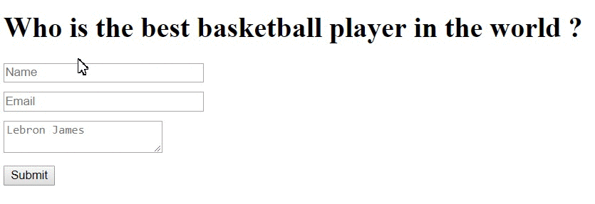

Form Validation
============================
Every form must be validate. In this form we check fields and alert users about errors before they submit the form.

In this form we check:
- name field has been filled out;
- email field must be like an email address;
- textarea field has been filled out.



###References

Create HTML page with form and add the id ***"form_*** *nameField"* for fields.<br/>
Look like this:
```html
<h1>Who is the best basketball player in the world ?</h1>
<form method="post" action="" id="player">
    <div>
        <input type="text" name="name" placeholder="Name" size="30" id="form_name">
        <span class="name-false">Please enter name</span>
    </div>
    <div>
        <input type="text" name="email" placeholder="Email" size="30" id="form_email">
        <span class="email-false">Please enter an email address</span>
    </div>
    <div>
        <textarea name="field" placeholder="Lebron James" cols="22" id="form_field"></textarea>
        <span class="field-false">Please write a player</span>
    </div>
    <button type="submit" id="submit">Submit</button>
</form>
```
Next step we create file ***style.css*** were we write style and include it to **html** file in *head* section:
```html
<link rel="stylesheet" href="style.css">
```

Than we create file ***main.js*** and include to **html** file too:
```html
<script type="text/javascript" src="main.js"></script>
```

If we want to work with **jQuery** we must download or include jQuery library - [Donwload jQuery](http://jquery.com/download/) and include it to **html** file:
```html
<script src="http://code.jquery.com/jquery-2.1.0.min.js"></script>
```

Now we have complete **html** file. We give name ***index.html***.

###jQuery
In ***main.js*** file we write code for validation form:<br/>
First we write *function*:
```javascript
$(document).ready(function(){
    // Handler for .ready() called.
});
```
It's specify function to execute when the DOM is fully loaded - [function ready](http://api.jquery.com/ready/)

Than we create variables for basic id's form:
```javascript
<!-- Form variables -->
var playerForm = $('#player'),
    button = $('#submit');
```
####Check name field:
```javascript
<!-- Name variables -->
var name = $('#form_name'),
    nameFalse = $('.name-false');

<!-- Checking the name field -->
name.on('input', function() {
    var input = $(this);
    var nameValid = input.val();
    if (nameValid) {
        input.addClass('valid');
        nameFalse.hide();
    } else {
        input.removeClass('valid');
        nameFalse.show();
    }
});
```

####Check email field:
```javascript
<!-- Email variables -->
var email = $('#form_email'),
    emailFalse = $('.email-false');

<!-- Checking the email field -->
email.on('input', function() {
    var input = $(this);
    var symbols = /^[a-zA-Z0-9.!#$%&'*+/=?^_`{|}~-]+@[a-zA-Z0-9-]+(?:\.[a-zA-Z0-9-]+)*$/;
    var emailValid = symbols.test(input.val());
    if (emailValid) {
        input.addClass('valid').removeClass('invalid');
        emailFalse.hide();
    } else {
        input.addClass('invalid');
    }
});
```

####Check textarea field:
```javascript
<!-- Textarea variables -->
var field = $('#form_field'),
    fieldFalse = $('.field-false');

<!-- Checking the textarea field -->
field.keyup(function(event){
    var input = $(this);
    var fieldPlayer = input.val();
    if (fieldPlayer) {
        field.addClass('valid');
        fieldFalse.hide();
    } else {
        field.removeClass('valid');
        fieldFalse.show();
    }
});
```

On the last step we check on the button ***submit*** all fields are valid:
```javascript
<!-- Submitted Validation -->
button.on('click', function(event){
    var form = playerForm.serializeArray();
    var error = true;
    for (var input in form) {
        var inputs = $('#form_' + form[input]['name']);
        var inputsFalse = $('span', inputs.parent());
        var valid = inputs.hasClass('valid');
        if (!valid) {
            inputsFalse.addClass('error');
            error = false;
        } else {
            inputsFalse.hide();
        }
    }
    if (!error) {
        event.preventDefault();
    } else {
        alert('Form is validate');
    }
});
```

Information
============
If you have some questions, problems or improvement for this form create issue and we will discuss.<br/>
Thank you!

License
========
[MIT License](http://opensource.org/licenses/mit-license.php)
